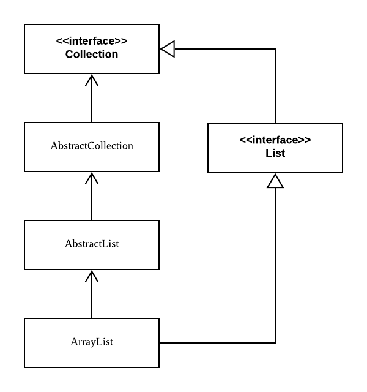

# item20) 추상 클래스보다는 인터페이스를 우선하라

## 자바가 제공하는 다중 구현 메커니즘  
1) 인터페이스 (자바8 부터 default method 제공)  
2) 추상클래스  

## 추상클래스 vs 인터페이스
* 추상클래스 :  
자바는 단일상속만 지원하므로, 추상클래스를 상속한 클래스는 다른 클래스를 상속받지 못함.    

* 인터페이스 :  
  - 어떤 클래스를 상속했든, 인터페이스를 구현한 경우 같은 타입으로 취급됨.  
  - 기존 클래스에도 손쉽게 새로운 인터페이스를 구현해 넣을 수 있음.  
  - mixin정의에 안성맞춤.  
    - mixin이란?  
   클래스가 구현할 수 있는 타입으로, 믹스인을 구현한 클래스에 원래의 '주된타입' 외에도 특정 선택적 행위를 제공한다고 선언하는 효과를 줌.  
   대상 타입의 주된 기능에 선택적 기능을 혼합해줌.  
   예. Comparable  
  - 인터페이스로 계층구조가 없는 타입 프레임워크를 만들 수 있다.  
  - 래퍼 클래스 관용구와 함께 사용하면 인터페이스는 기능을 향상시키는 안전하고 강력한 수단이 된다.  
  - 인터페이스 메서드 중 구현 방법이 명백한 것이 있다면, default method로 제공해 프로그래머의 일감을 덜어줄 수 있다.  
    - default method 사용시 유의 사항  
      1. 상속하려는 사람을 위한 설명을 @implSpec 자바독 태그를 붙여 문서화 해야한다.  
      2. equals, hashCode 같은 Object의 메서드를 default method로 제공해선 안된다.  
  - 추상 골격 구현(skeletal implementation) 클래스를 함께 제공하면 인터페이스와 추상클래스의 장점을 모두 취할 수 있다.  
   골격구현을 확장하는 것으로 인터페이스 구현이 거의 끝난다.  
  예) AbstractCollection, AbstractList 등  
  - 구조상 골격구현을 확장하지 못하는 경우, 인터페이스를 구현한 클래스에서 골격구현을 확장한 private 내부 클래스를 정의하여 사용할 수 있다.
  
  [참고] ArrayList 

  
## 골격 구현 작성 방법  
1. 다른 메서드들의 구현에 사용되는 기반 메서드들을 선정한다. 기반메서드는 골격 구현에서 추상 메서드가 된다.  
2. 기반 메서드들을 사용해 직접 구현할 수 있는 메서드를 디폴트 메서드로 제공한다. (단, equals, hashCode같은 Object의 메서드는 안됨)  
3. 기반메서드나 디폹트 메서드로 만들지 못한 메서드가 남아 있다면, 인터페이스를 구현하는 골격 구현 클래스를 만들어 남은 메서드들을 작성한다.  
인터페이스의 메서드가 모두 기반메서드와 디폴트 메서드가 된다면 골격 구현 클래스를 별도로 만들 필요가 없다.  
골격 구현 클래스에는 필요하면 public이 아닌 필드와 메서드를 추가해도 된다.  
예) Map.Entry  

골격구현은 기본적으로 상속해서 사용하는 걸 가정하므로, 아이템19의 설계 및 문서화 지침을 모두 따라야한다.  
단순 구현(simple implementation)은 골격 구현의 작은 변종으로, 상속을 위해 인터페이스를 구현한 것이지만 추상클래스가 아니다.  
그대로 사용해도 되고 필요에 맞게 확장해서 사용해도 된다.    
예) Map.SimpleEntry

## 정리 
1. 일반적으로 다중 구현용 타입으로는 인터페이스가 가장 적합하다.  
2. 복잡한 인터페이스라면 골격 구현을 함께 제공하여 구현하는 수고를 덜어 줄 수 있는 방법을 고려하자.  
3. 골격 구현은 가능한 한 인터페이스의 디폴트 메서드로 제공하여, 그 인터페이스를 구현한 모든 곳에서 활용하도록 하는 것이 좋다.  
하지만 인터페이스의 구현상 제약 때문에 골격 구현을 추상 클래스로 제공하는 경우가 더 흔하다.

> 출처  
Effective java 3/E (조슈아 블로크)

> 참고자료  
[Java8 docs - List](https://docs.oracle.com/javase/8/docs/api/java/util/List.html)